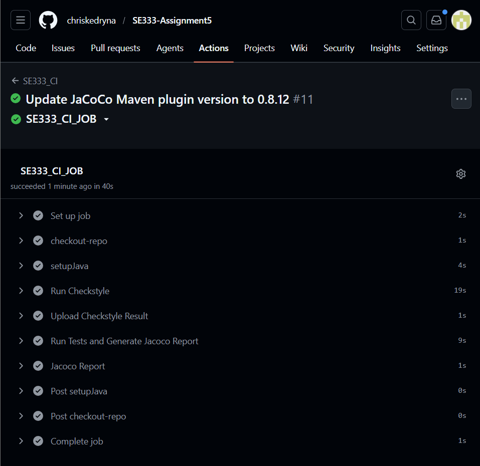
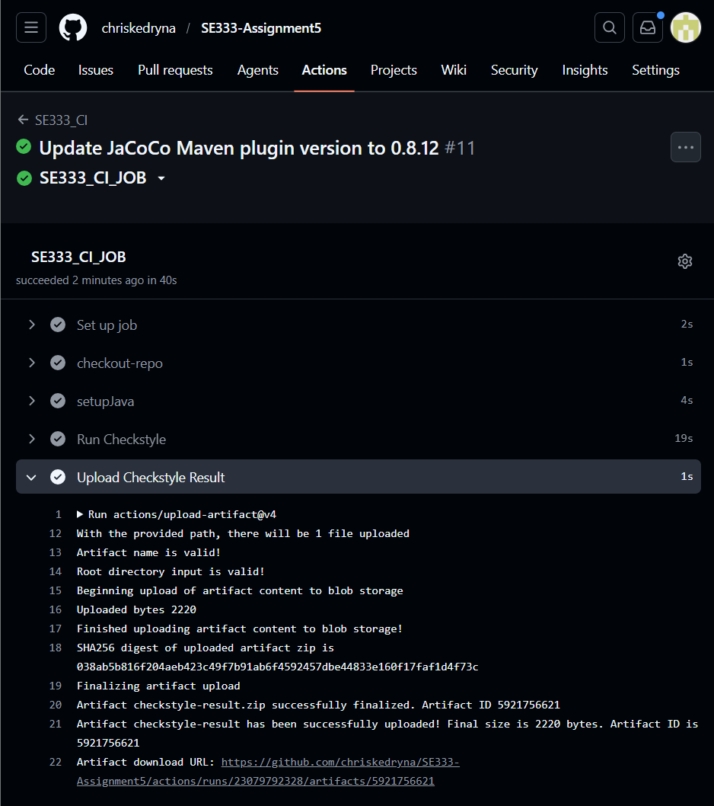
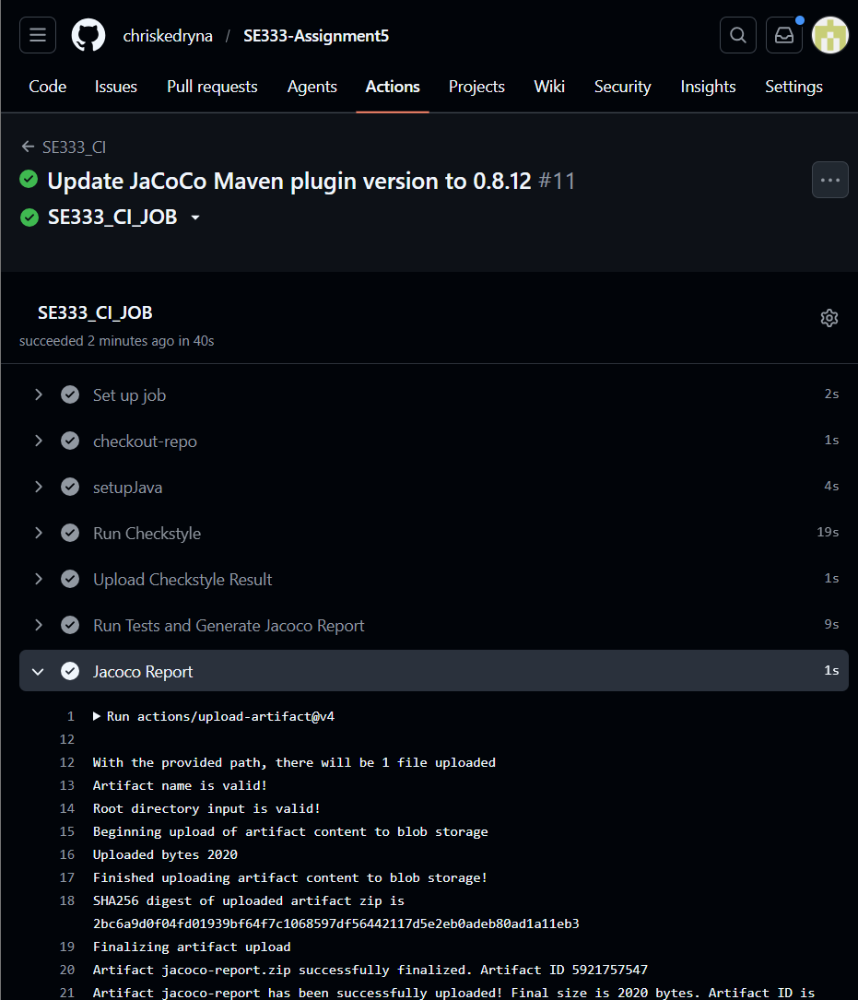

## Part 1

- Link to repository: https://github.com/chriskedryna/SE333-Assignment5/actions/runs/23079792328/job/67046744451
- Screenshots of all actions passing and artifacts being uploaded:
  
  
  
